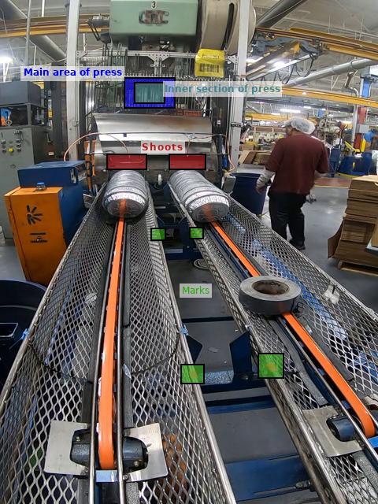
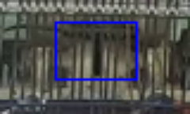
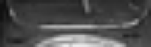
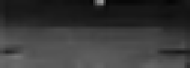

# Plates manufacturing image processor.

This software uses computer vision techniques to process video sequences of a machine used to manufacture plates. It is written in Python using OpenCV to do the processing.

## Requirements

  - Python v3+
  - OpenCV v3.4.3
  - Numpvy v1.15.2
  - Matplotlib v2.2.2

## How to use

In the command line, go to the src file of this repository, and type the following command:

`python main.py path_to_video`

`path_to_video` is the location of the video file to process. The path can be absolute or relative. For instance, for a video which path is `./video/new_video.mp4`, the command is the following:

`python main.py ./video/new_video.mp4`

### Options
<figure style="text-align: center;">
	
	<figcaption><b>Image 1. </b>Reference sections of the machine in the frames.</figcaption>
</figure>
 

The program has several parameters to set. The options have default values set based on **Image 1**. The parameters are the following:

  - **Parameters for the press:**

	- **`-pxc`** Horizontal position of the center of the main area of the press. Default value is `188`.
	- **`-phw`** Half width of the main area of the press. Default value is `40`.
	- **`-pyc`** Vertical position of the center of the main area of the press. Default value is `118`.
	- **`-phh`** Half height of the main area of the press. Default value is `24`.
	- **`-pyb`** Vertical position of the inner area of the press. This value is relative to the main area. Default value is `8`.
	- **`-pbw`** Half width of the inner area of the press. Default value is `17`.
	- **`-pbh`** Half height of the inner area of the press. Default value is `12`.
	- **`-ptt`** Name of one of the built-in trackers in OpenCV. Default value is `BOOSTING`.

  - **Parameters for the shoots:**

    - **`-sx1`** Horizontal position of top corner of left shoot. Default value is `137`.
    - **`-sy1`** Vertical position of top corner of left shoot. Default value is `198`.
    - **`-sw1`** Width of left shoot. Default value is `48`.
    - **`-sh1`** Height of left shoot. Default value is `15`.
	- **`-sx2`** Horizontal position of top corner of right shoot. Default value is `216`.
    - **`-sy2`** Vertical position of top corner of right shoot. Default value is `198`.
    - **`-sw2`** Width of right shoot. Default value is `42`.
    - **`-sh2`** Height of right shoot. Default value is `15`.

  - **Parameters for the bands:**

    - **`-bx1`** Horizontal position of upper mark in left band. Default value is `200`.
    - **`-by1`** Vertical position of upper mark in left band. Default value is `296`.
    - **`-bx2`** Horizontal position of upper mark in right band. Default value is `249`.
    - **`-by2`** Vertical position of upper mark in right band. Default value is `295`.
    - **`-bx3`** Horizontal position of lower mark in left band. Default value is `245`.
    - **`-by3`** Vertical position of lower mark in left band. Default value is `474`.
    - **`-bx4`** Horizontal position of lower mark in right band. Default value is `344`.
    - **`-by4`** Vertical position of lower mark in right band. Default value is `465`.
    - **`-bxd`** Horizontal position of upper left corner of destination box. Default value is `150`.
    - **`-byd`** Vertical position of upper left corner of destination box. Default value is `100`.
    - **`-bwd`** Width of destination box. Default value is `30`.
    - **`-bhd`** Height of destination box. Default value is `180`.

  - **Miscelaneous:**

    - **`-o`** Name of the output video. This option allows the creation of a video with caption of the processing information, as seen in **Image 2**.

    - **`-a`** Flag used for analysis. Default value is `False`. When the value is `True`, the program displays windows with images of the processing for the press (**Image 3**), the shoots (**Image 4** and **Image 5**), and the bands (**Image 6**).

<figure style="text-align: center;">
	
	<figcaption><b>Image 2. </b>Example of frame in output video.</figcaption>
</figure>

<figure style="text-align: center;">
	
	<figcaption><b>Image 3. </b>Image of press processing.</figcaption>
</figure>

<figure style="text-align: center;">
	
	<figcaption><b>Image 4. </b>Image of left shoot processing.</figcaption>
</figure>

<figure style="text-align: center;">
	
	<figcaption><b>Image 5. </b>Image of right shoot processing.</figcaption>
</figure>

<figure style="text-align: center;">
	
	<figcaption><b>Image 6. </b>Image of bands processing.</figcaption>
</figure>

### Output
Once the processing is done, the sofware creates several files:

  - **Reports**:
	  - **Press moves**: It is a csv file with timestamps of the press in down position. The name of the file has the following format:

	    `press_0_[Date and time]_[Simple name of video].csv`.

	  - **Plates counting**: They are a couple of csv files with the timestamps of the plates coming out of the shoots. The names of the files has the following format:

	    `plates_[Shoot number]_[Date and time]_[Simple name of video].csv`.

	  - **Alarms**: It is a csv file with the timestamps corresponding to the lines of plates reaching the marks in the bands of the machine. The name of the file has the following format:

	    `alarms_3_[Date and time]_[Simple name of video].csv`.

  - **Plots**:
	  - **Press moves**: It is a png file showing the signal of press moves created when processing the video. The name of the file has the following format:

	    `PressCounter_0_[Date and time]_[Simple name of video].csv`.

	  - **Plates counting**: They are png files showing the signals of plates counting created when processing the video. The names of the files has the following format:

	    `PlatesCounter_[Shoot number]_[Date and time]_[Simple name of video].csv`.

	  - **Alarms**: It is a png file showing the signal of plates moves over the bands created when processing the video. The name of the file has the following format:

	    `LineAlarm_3_[Date and time]_[Simple name of video].csv`.

  - **Miscelaneous**:
  	  - **Output video**: Available when the option **`-o`** has been set.